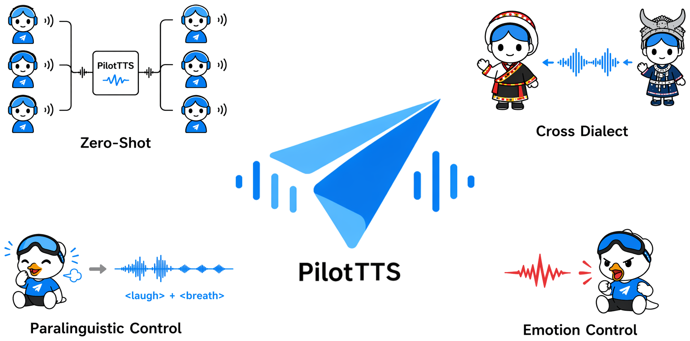

# PilotTTS: A Disciplined Modular Recipe for Competitive Speech Synthesis

<div align="center">

</div>

<p align="center">
    English &nbsp;|&nbsp; <a href="README_zh.md">中文</a>
</p>

<p align="center">
    📑 <a href="https://arxiv.org/abs/2605.27258">Paper</a> &nbsp;|&nbsp; 🤗 <a href="https://huggingface.co/AmapVoice/PilotTTS">HuggingFace</a> &nbsp;|&nbsp; 🤖 <a href="https://www.modelscope.cn/models/AmapVoice/PilotTTS">ModelScope</a> &nbsp;|&nbsp; 🎧 <a href="https://amapvoice.github.io/PilotTTS/">Demos</a>
</p>


## News 📝

- **[Coming Soon]** Expanding support for 14+ dialects, with model weights to be released soon
- **[2026.05]** Release Pilot-TTS base and instruct model weights

## Highlight 🔥

**PilotTTS** is an LLM-based text-to-speech (TTS) system that builds an intentionally simplified architecture with fully open-source components and achieves competitive performance through rigorous data engineering.

### Key Features
- **A fully open-source data processing pipeline:** We design a multi-stage pipeline that incorporates quality assessment and enhancement, annotation, and quality filtering, where all operators are implemented using publicly available tools. This pipeline converts large-scale Internet audio into clean training data with rich annotation, achieving high-quality data generation while substantially reducing costs.
- **Content Consistency and Speaker Similarity Control:** On the Seed-TTS test set, our model achieves state-of-the-art speaker similarity (0.862) and highly competitive content accuracy (CER 0.87%).
- **Emotion and Paralinguistic Control:** Supports controllable synthesis for 11 emotion categories (Happy, Sad, Fear, Angry, Contempt, Serious, Surprise, Blue, Concern, Disgust, Psychology) and 4 paralinguistic categories (LAUGH, BREATH, CRY, COUGH).
- **Dialect Control:** Supports 14 Chinese dialects and enables cross-dialect synthesis, with particular strength in synthesizing from Mandarin Chinese to the target dialect.

## Installation ⚙️

### Clone and install

```bash
git clone https://github.com/xxx/pilot-tts.git
cd pilot-tts
```

### Environment setup

```bash
conda create -n pilot-tts python=3.10 -y
conda activate pilot-tts
pip install -r requirements.txt
```

### Model download

#### 1. Pilot-TTS models (our weights)

```python
# ModelScope
from modelscope import snapshot_download
snapshot_download('xxx/Pilot-TTS', local_dir='pretrained_models/')

# HuggingFace
from huggingface_hub import snapshot_download
snapshot_download('xxx/Pilot-TTS', local_dir='pretrained_models/')
```

This includes: `pilot_tts.pt`, `pilot_tts_instruct.pt`, and `tokenizer/`.

#### 2. Third-party open-source models

Download the following dependencies from their respective open-source projects:

```python
from modelscope import snapshot_download

# Qwen3-0.6B (LLM backbone)
snapshot_download('Qwen/Qwen3-0.6B', local_dir='pretrained_models/Qwen3-0.6B')

# CosyVoice3 (flow-matching vocoder, includes campplus.onnx)
snapshot_download('FunAudioLLM/Fun-CosyVoice3-0.5B-2512', local_dir='pretrained_models/CosyVoice3-0.5B')
```

```python
from huggingface_hub import snapshot_download

# w2v-bert-2.0 (audio feature extractor)
snapshot_download('facebook/w2v-bert-2.0', local_dir='pretrained_models/w2v-bert-2.0')
```

> Note: `wav2vec2bert_stats.pt` (from [MaskGCT](https://github.com/open-mmlab/Amphion/tree/main/models/tts/maskgct)) is included in the Pilot-TTS model package.

#### Final directory structure

```
pretrained_models/
├── pilot_tts.pt              # Base model (zero-shot voice cloning)
├── pilot_tts_instruct.pt     # Instruct model (emotion, paralanguage, dialect)
├── Qwen3-0.6B/              # LLM backbone (from Qwen)
├── w2v-bert-2.0/            # Audio feature extractor (from Meta)
├── wav2vec2bert_stats.pt    # Feature normalization stats (from MaskGCT)
└── CosyVoice3-0.5B/        # Flow-matching vocoder (from FunAudioLLM)
```

## Quick Start 📖

Run all inference demos with a single command:

```bash
python demo.py
```

## Inference

### Python API

```python
from demo import load_engine, synthesize

# Zero-shot voice cloning (base model)
engine = load_engine(
    config_path="configs/infer_pilot_tts.yaml",
    checkpoint="pretrained_models/pilot_tts.pt",
)

synthesize(engine, text="你好，世界！",
           prompt_wav="assert/prompt.wav",
           output_path="output/clone.wav")

# Load instruct model (emotion, paralanguage, dialect)
engine_instruct = load_engine(
    config_path="configs/infer_pilot_tts_instruct.yaml",
    checkpoint="pretrained_models/pilot_tts_instruct.pt",
)

# Emotion synthesis
synthesize(engine_instruct, text="今天天气真好啊！",
           prompt_wav="assert/prompt.wav",
           emotion="happy", output_path="output/happy.wav")

# Paralanguage
synthesize(engine_instruct, text="这太好笑了<|LAUGH|>停不下来",
           prompt_wav="assert/prompt.wav",
           output_path="output/laugh.wav")

# Dialect (Henan)
synthesize(engine_instruct, text="中不中啊，咱俩一块儿去吃胡辣汤吧",
           prompt_wav="assert/prompt.wav",
           language="zh-henan", output_path="output/henan.wav")
```

### Command Line

```bash
# Zero-shot voice cloning (base model)
python inference.py \
    --checkpoint pretrained_models/pilot_tts.pt \
    --prompt-wav assert/prompt.wav \
    --text "需要合成的目标文本" \
    --output output/zeroshot.wav

# Emotion synthesis (instruct model)
python inference.py \
    --config configs/infer_pilot_tts_instruct.yaml \
    --checkpoint pretrained_models/pilot_tts_instruct.pt \
    --prompt-wav assert/prompt.wav \
    --text "今天天气真好啊，我们去公园玩吧！" \
    --emotion happy \
    --output output/emotion.wav

# Paralanguage (instruct model)
python inference.py \
    --config configs/infer_pilot_tts_instruct.yaml \
    --checkpoint pretrained_models/pilot_tts_instruct.pt \
    --prompt-wav assert/prompt.wav \
    --text "这个笑话太好笑了<|LAUGH|>我真的忍不住" \
    --output output/paralang.wav

# Dialect synthesis (instruct model)
python inference.py \
    --config configs/infer_pilot_tts_instruct.yaml \
    --checkpoint pretrained_models/pilot_tts_instruct.pt \
    --prompt-wav assert/prompt.wav \
    --text "中不中啊，咱俩一块儿去吃胡辣汤吧" \
    --language zh-henan \
    --output output/dialect.wav
```

### Supported Controls

| Feature | Usage | Model |
|---------|-------|-------|
| Voice Cloning | Provide prompt audio | Both |
| Emotions | `--emotion <tag>` | Instruct |
| Paralanguage | Insert tags in text | Instruct |
| Dialects | `--language <dialect>` | Instruct |

**Emotions:**

| Tag | 情感 | Tag | 情感 |
|-----|------|-----|------|
| `happy` | 开心 | `sad` | 悲伤 |
| `angry` | 愤怒 | `surprise` | 惊讶 |
| `fear` | 恐惧 | `disgust` | 厌恶 |
| `serious` | 严肃 | `concern` | 关切 |
| `blue` | 忧郁 | `disdain` | 轻蔑 |
| `neutral` | 中性/平静 | `psychology` | 心理活动 |
| `unknown` | 不指定情感 | | |

**Paralanguage tags:**

| Tag | Description |
|-----|-------------|
| `<\|LAUGH\|>` | 笑声 |
| `<\|BREATH\|>` | 呼吸声 |
| `<\|COUGH\|>` | 咳嗽 |
| `<\|CRY\|>` | 哭泣声 |
| `<\|LAUGH_SPAN\|>...<\|/LAUGH_SPAN\|>` | 包裹笑声文本 |

**Dialects:**

| Tag | 方言 | Tag | 方言 |
|-----|------|-----|------|
| `zh-dongbei` | 东北话 | `zh-shandong` | 山东话 |
| `zh-henan` | 河南话 | `zh-shan1xi` | 山西话 |
| `zh-minnan` | 闽南语 |  `zh-gansu` | 甘肃话 |
| `zh-ningxia` | 宁夏话 | `zh-shanghai` | 上海话 |
| `zh-chongqing` | 重庆话 | `zh-hubei` | 湖北话 |
| `zh-hunan` | 湖南话 | `zh-jiangxi` | 江西话 |
| `zh-guizhou` | 贵州话 | `zh-yunnan` | 云南话 |

## WebUI

Launch a Gradio-based interactive interface:

```bash
python webui.py --port 9000
```

## Project Structure

```
pilot-tts/
├── configs/                     # Inference configurations (per checkpoint)
├── demo.py                      # Complete demo (all inference modes)
├── inference.py                 # CLI inference entry
├── webui.py                     # Gradio WebUI
├── asset/                       # Example prompt audio
├── pilot_voice/                 # Core model code
│   ├── engine.py                # InferenceEngine pipeline
│   ├── model.py                 # AR model (Qwen3 backbone + audio tokens)
│   ├── sampling.py              # RAS sampling (from VALL-E 2)
│   ├── utils.py                 # Utilities
│   ├── modules/                 # Conformer + Perceiver modules
│   └── tools/                   # Audio & text processing
├── third_party/
│   ├── cosyvoice/               # Flow-matching vocoder
│   └── Matcha-TTS/              # Flow matching dependency
├── tokenizer/                   # Custom tokenizer with special tokens
├── pretrained_models/           # Model weights (not in git)
└── requirements.txt
```

## Acknowledgements

- [CosyVoice](https://github.com/FunAudioLLM/CosyVoice) — Flow-matching & Vocoder
- [Qwen3](https://github.com/QwenLM/Qwen3) — LLM backbone
- [Matcha-TTS](https://github.com/shivammehta25/Matcha-TTS) — Flow matching framework
- [MaskGCT](https://github.com/open-mmlab/Amphion/tree/main/models/tts/maskgct) — wav2vec2bert feature statistics

## Citation

```bibtex

@article{pilottts2026,
      title={PilotTTS: A Disciplined Modular Recipe for Competitive Speech Synthesis},
      author={Bowen Li and Shaotong Guo and Zhen Wang and Yang Xiang and Mingli Jin and Yihang Lin and Jiahui Zhao and Weibo Xiong and Dongrui Li and Keming Chen and Yunze Gao and Yuze Zhou and Zeyang Lin and Yue Liu},
      year={2026},
      journal={arXiv preprint arXiv:2605.27258}
}
```

## License

Apache-2.0
